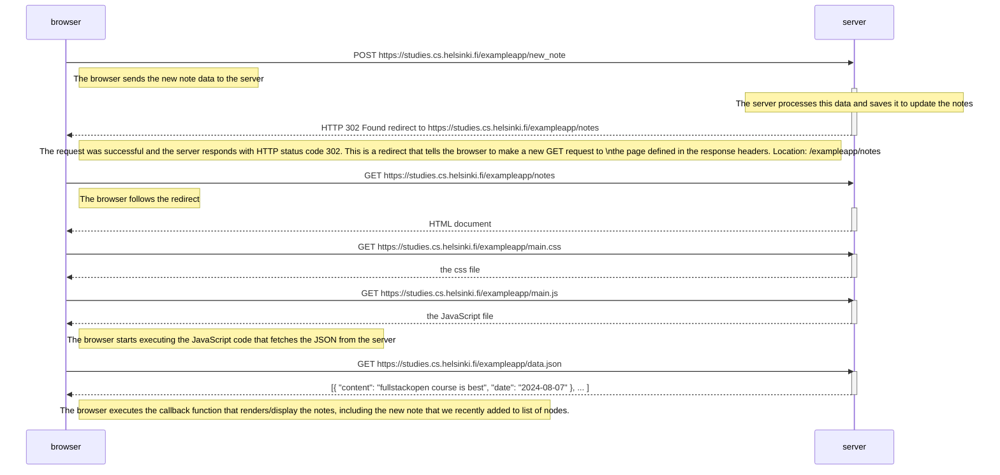

```mermaid

sequenceDiagram
    participant browser
    participant server

    browser->>server: POST https://studies.cs.helsinki.fi/exampleapp/new_note
    Note right of browser: The browser sends the new note data to the server
    activate server
    Note over server: The server processes this data and saves it to update the notes
    server-->>browser: HTTP 302 Found redirect to https://studies.cs.helsinki.fi/exampleapp/notes
    deactivate server

    Note right of browser: The request was successful and the server responds with HTTP status code 302. This is a redirect that tells the browser to make a new GET request to \nthe page defined in the response headers. Location: /exampleapp/notes

    browser->>server: GET https://studies.cs.helsinki.fi/exampleapp/notes
    Note right of browser: The browser follows the redirect
    activate server
    server-->>browser: HTML document
    deactivate server

    browser->>server: GET https://studies.cs.helsinki.fi/exampleapp/main.css
    activate server
    server-->>browser: the css file
    deactivate server

    browser->>server: GET https://studies.cs.helsinki.fi/exampleapp/main.js
    activate server
    server-->>browser: the JavaScript file
    deactivate server

    Note right of browser: The browser starts executing the JavaScript code that fetches the JSON from the server

    browser->>server: GET https://studies.cs.helsinki.fi/exampleapp/data.json
    activate server
    server-->>browser: [{ "content": "fullstackopen course is best", "date": "2024-08-07" }, ... ]
    deactivate server

    Note right of browser: The browser executes the callback function that renders/display the notes, including the new note that we recently added to list of nodes.

```
